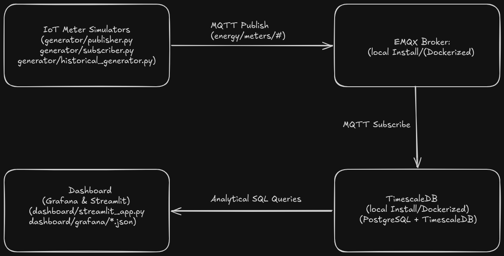
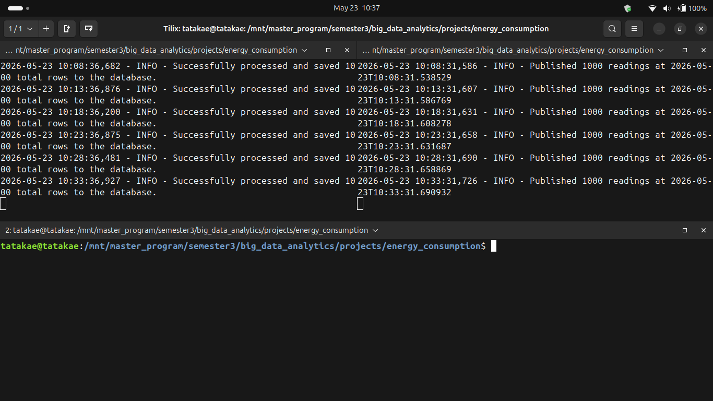
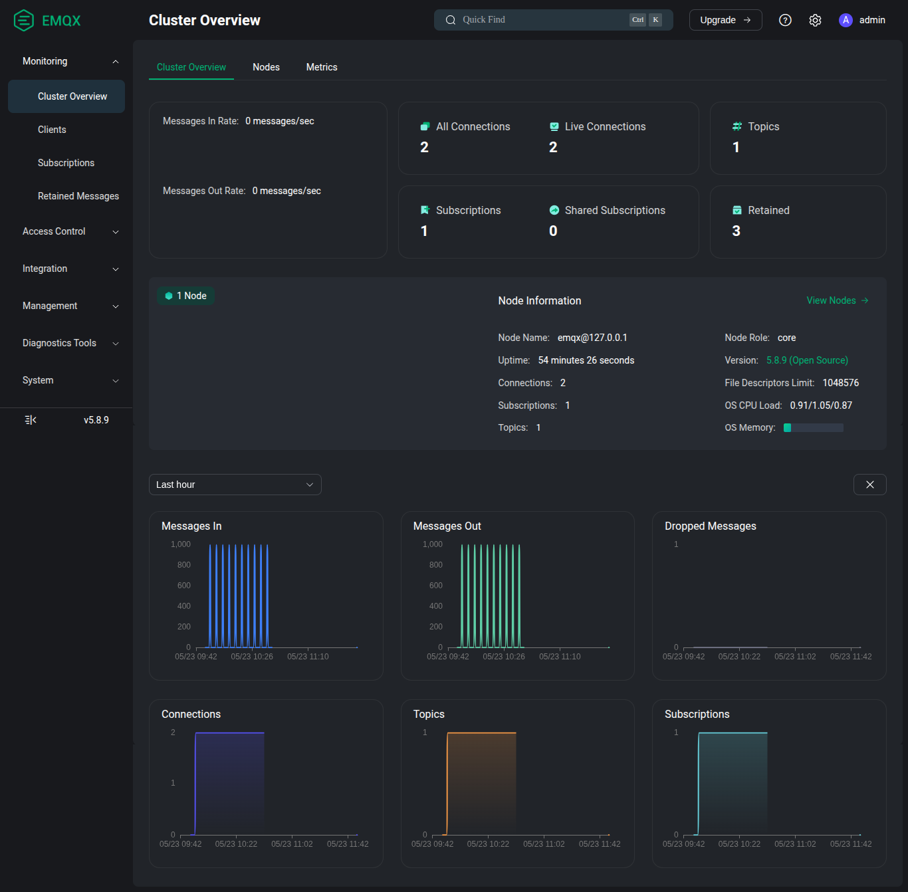
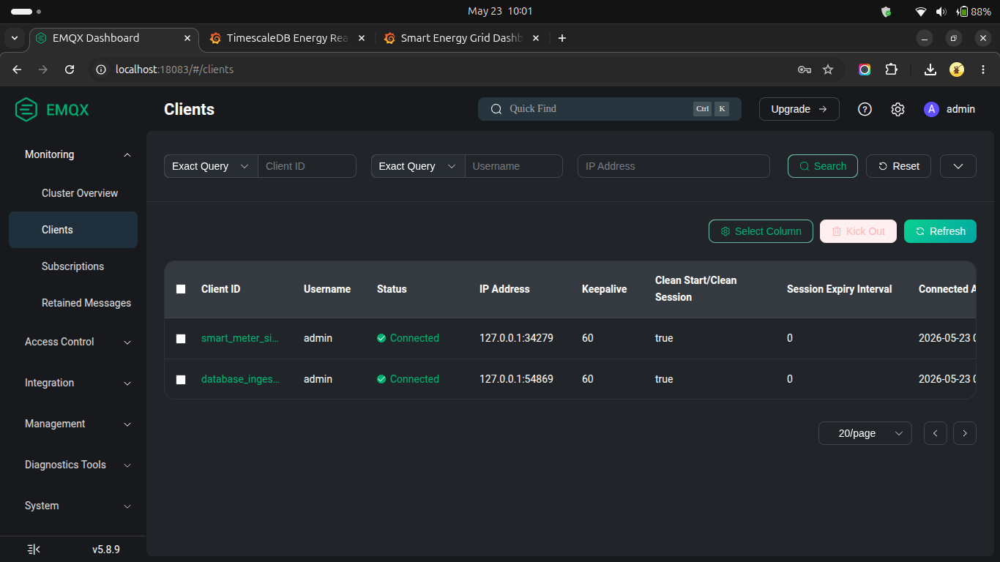
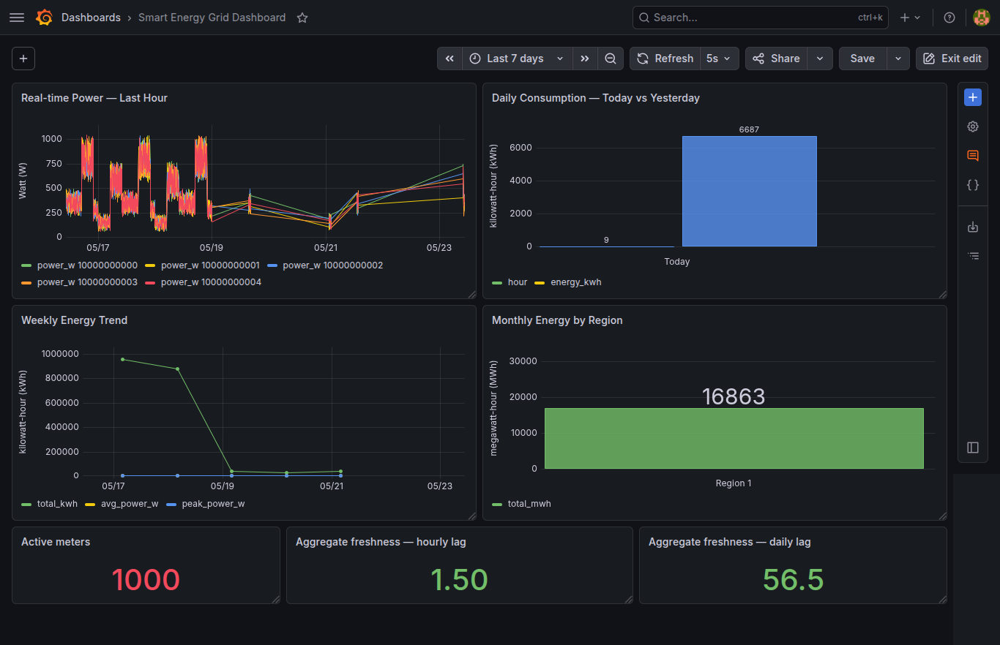
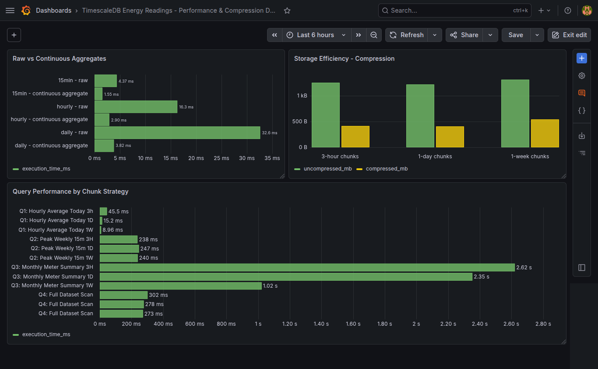
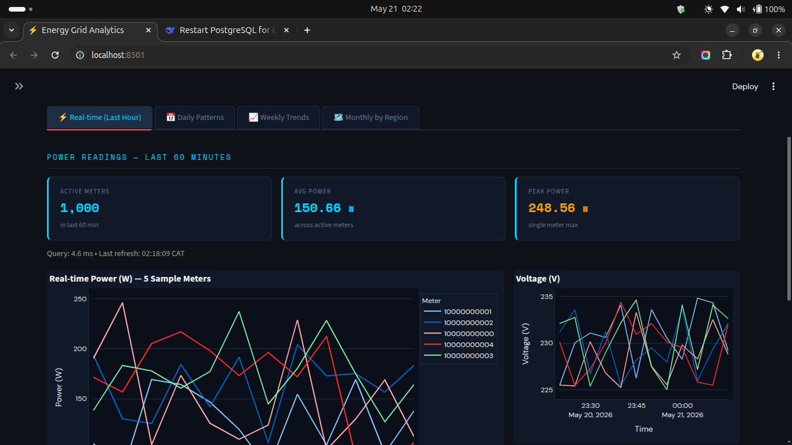
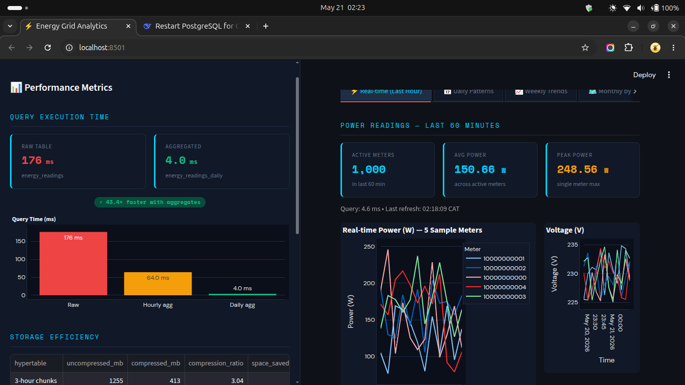
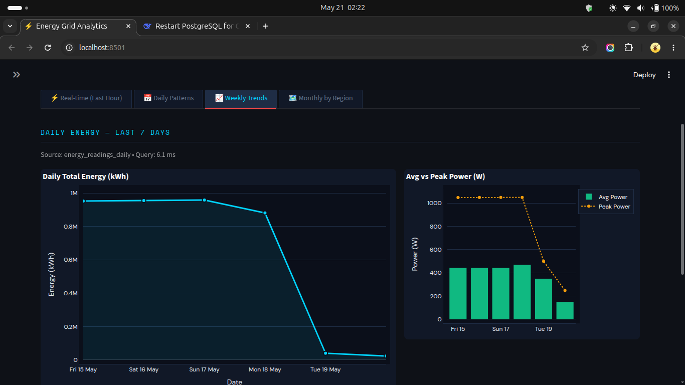

# Smart Energy Grid Data Ingestion & Analytics Pipeline

**Program:** Master's in Big Data Analytics | **Date:** May 2026

---

## Tech Stack Badges


---

## 🏗️ Architecture Design

This project simulates a real‑time Smart Grid IoT environment. It generates high‑frequency power readings, streams them through an MQTT broker, and ingests them into an optimised TimescaleDB database. The system is then analysed and visualised through grafana, and Streamlit dashboard.

### Data Flow Diagram



### Architectural Layers

1. **Data Generation & Messaging (MQTT):** Simulates IoT smart meters using realistic time‑of‑day consumption curves. Payloads are published to an EMQX broker.
2. **Ingestion Layer:** A Python subscriber listens to MQTT topics and writes data to TimescaleDB using efficient bulk inserts.
3. **Storage & Optimisation (TimescaleDB):** Raw data is stored in hypertables with different chunking strategies (3‑hour, 1‑day, 1‑week). Native columnar compression and continuous aggregates are applied to boost analytical performance.
4. **Visualisation:** An interactive dashboard shows real‑time power consumption, historical patterns, and key engineering metrics (compression ratios, query speedups).

---

## 📂 Project Tree

```text
├── analysis/
│   ├── __init__.py
│   ├── step3_execution.py
│   ├── step4_chunk_distribution.py
│   ├── step4_execution_1w.py
│   ├── step4_execution_3h.py
│   ├── step4_hypertables.py
│   ├── step4_report.py
│   ├── step5_compression.py
│   ├── step5_execution_1d.py
│   ├── step5_execution_1w.py
│   ├── step5_execution_3h.py
│   ├── step5_execution_report.py
│   ├── step5_report.py
│   ├── step5_size1.py
│   ├── step5_size2.py
│   ├── step6_queries_performance.py
│   └── step6_views_creation.py
├── broker/
│   ├── __init__.py
│   ├── publisher.py
│   └── subscriber.py
├── config/
│   ├── __init__.py
│   └── config.py
├── dashboard/
│   ├── grafana/
│   │   ├── dashboard.json
│   │   └── dashboard_performance.json
│   ├── __init__.py
│   └── streamlit_app.py
├── database/
│   ├── __init__.py
│   ├── db_setup.py
│   └── db_writer.py
├── generator/
│   ├── __init__.py
│   ├── generator.py
│   └── historical_generator.py
├── screenshots/
│   ├── broker.png
│   ├── dashboard.png
│   ├── dashboard_performance.png
│   ├── diagram.png
│   ├── emqx_clients.png
│   ├── emqx_dashboard.png
│   ├── streamlit_chunk.png
│   ├── streamlit_performance.png
│   ├── streamlit_real_time.png
│   └── streamlit_weekly.png
├── sql/
│   └── queries.sql
├── .env.example
├── .gitignore
├── LICENSE
├── README.md
└── requirements.txt
```

---

## ⚙️ Prerequisites

- **Python 3.11+**
- **pip** (Python package manager)
- **EMQX and TimescaleDB** (Installed locally) / **Docker & Docker Compose** (for EMQX and TimescaleDB)
- A blank PostgreSQL database (e.g., `energy_db`)
- **libraries**: paho-mqtt, pandas, plotly, psycopg2-binary, python-decouple, sqlalchemy, streamlit, tqdm

---

## Setup & Installation

**1. Clone & create venv**:

```bash
git clone https://github.com/Elthiero/energy-consumption.git
cd energy-consumption

#linux & mac
python3 -m venv venv
source venv/bin/activate
pip install -r requirements.txt

#windows
python -m venv venv
venv\Scripts\activate
pip install -r requirements.txt
```

**2. Environment Variables**:

```bash
cp .env.example .env
```

Edit `.env` with your actual credentials. Example:

```ini
POSTGRES_USER=postgres
POSTGRES_PASSWORD=your_secret_password
POSTGRES_DB=energy_db
POSTGRES_HOST=localhost
MQTT_HOST=localhost
NUM_METERS=1000
PUBLISH_INTERVAL_SEC=300
HISTORICAL_WEEKS=4
```

---

## Running the Pipeline

If you do not have EMQX and Postgresql(with TimescaleDB extension), start your Docker containers (TimescaleDB & EMQX) first:

```bash
docker compose up -d    # start
docker compose stop     # stop
```

### Step 1 – Database Initialisation

```bash
python -m database.db_setup
```

### Step 2 – Generate Historical Data

```bash
python -m generator.historical_generator
```

### Step 3 – Start Real‑Time MQTT Stream

Open **two terminals**:

- **Terminal 1 (Subscriber):**

  ```bash
  python -m broker.subscriber
  ```

- **Terminal 2 (Publisher):**

  ```bash
  python -m broker.publisher
  ```

Let them run for 1 hour to accumulate live data.





### Step 4 – Run Analytics & Generate Reports

```bash
# Baseline benchmarks
python -m analysis.step3_execution_1d

# Different chunking strategies
python -m analysis.step4_hypertables
python -m analysis.step4_execution_3h
python -m analysis.step4_execution_1w
python -m analysis.step4_chunk_distribution

# Benchmarks step 3 & 4
python -m analysis.step4_report

# Compression setup & benchmarking
python -m analysis.step5_size1
python -m analysis.step5_compression
python -m analysis.step5_size2
python -m analysis.step5_execution_1d
python -m analysis.step5_execution_3h
python -m analysis.step5_execution_1w
python -m analysis.step5_execution_report
python -m analysis.step5_report

# Continuous aggregates
python -m analysis.step6_views_creation
python -m analysis.step6_queries_performance
```

### Step 5 – Launch the Dashboard

For Grafana you can copy the json code from `dashboard/grafana/` add them as import inside grafana, add your database connection and rerun the query.



Or Just use Streamlit for the dashboard.

```bash
python streamlit run dashboard/streamlit_app.py
```

Open `http://localhost:8501` in your browser.





---

## 📊 Interpretation of Findings

All numbers below come from the CSVs generated inside `data/`.

### 1. Storage Efficiency (Compression)

| Hypertable       | Uncompressed | Compressed | Ratio | Space saved |
|------------------|--------------|------------|-------|-------------|
| 3‑hour chunks    | 1255 MB      | 413 MB     | 3.04  | ~67%        |
| 1‑day chunks     | 1224 MB      | 410 MB     | 2.99  | ~66%        |
| 1‑week chunks    | 1320 MB      | 541 MB     | 2.44  | ~59%        |

**Interpretation:** TimescaleDB’s native columnar compression reduces storage footprint by **60–70%**, which is critical for long‑term retention of high‑frequency IoT data.

### 2. Chunk Strategy Trade‑offs

| Query                         | 3‑hour chunks (ms) | 1‑day chunks (ms) | 1‑week chunks (ms) |
|-------------------------------|--------------------|-------------------|--------------------|
| Q1 – Hourly avg today         | 147.58             | 20.69             | 10.38              |
| Q2 – Peak weekly 15m          | 87.95              | 103.34            | 189.64             |
| Q3 – Monthly meter summary    | 1576.29            | 1470.58           | 706.67             |
| Q4 – Full dataset scan        | 120.79             | 78.46             | 109.45             |

**Interpretation:**

- **Narrow chunks (3h)** are fastest for point‑in‑time queries (e.g., recent hours) but slower for full scans due to many small chunks.  
- **Wider chunks (1d, 1w)** reduce planning overhead and perform better on large‑range aggregations.  
- Choose chunk interval based on your dominant query pattern.

### 3. Query Performance Change After Compression

| Query                         | 3‑hour chunks (%) | 1‑day chunks (%) | 1‑week chunks (%) |
|-------------------------------|-------------------|------------------|-------------------|
| Q1 – Hourly avg today         | +224.5 (slower)   | +36.1 (slower)   | +15.8 (slower)    |
| Q2 – Peak weekly 15m          | -63.1 (faster)    | -58.2 (faster)   | -20.9 (faster)    |
| Q3 – Monthly meter summary    | -39.9 (faster)    | -37.5 (faster)   | -30.9 (faster)    |
| Q4 – Full dataset scan        | -60.0 (faster)    | -71.8 (faster)   | -59.9 (faster)    |

**Interpretation:**

- Queries that scan large time ranges or the entire dataset become **significantly faster** because compressed data reduces I/O.  
- Queries that touch only the very latest data (hourly average today) may become slightly slower due to decompression overhead, a known trade‑off.  
- Overall, compression delivers dramatic speedups for analytical workloads (up to **72% faster** on full scans).

### 4. Continuous Aggregates (Pre‑computed Views)

| Query Type                | Raw (ms) | Continuous Aggregate (ms) | Speedup |
|---------------------------|----------|---------------------------|---------|
| 15‑minute bucket (1 day)  | 4.37     | 1.55                      | 2.8×    |
| Hourly bucket (7 days)    | 16.29    | 2.9                       | 5.61×   |
| Daily bucket (30 days)    | 32.59    | 3.82                      | 8.53×   |

**Interpretation:**

- Continuous aggregates pre‑compute time‑bucketed aggregations in the background.  
- Queries that would otherwise scan millions of rows instead read a few dozen pre‑aggregated rows.
- Essential for real‑time dashboards that need to show historical trends without noticeable latency.

---

## 📈 Dashboard Features

The Streamlit dashboard (`dashboard/streamlit_app.py`) provides:

1. **Real‑time last hour** – live power readings.
2. **Daily consumption** – hourly bar chart comparing today (partial) with yesterday (full).
3. **Weekly trends** – line chart of total energy over the last 7 days.
4. **Monthly usage by region** – groups meters by the first digit of their ID (1-9).
5. **Performance metrics panel** – displays compression ratios, query speedups, and a side‑by‑side comparison of chunk strategies (full scan query times).

All queries use **continuous aggregates** where appropriate, ensuring sub‑second response times even on large datasets.

---

## Reproducibility

- All benchmark CSVs are stored in `data/`.  
- The scripts `analysis/step6_queries_performance.py` automatically generate the summary tables shown above.  
- To re‑run the entire pipeline from scratch, simply delete the data folder contents, restart the Docker containers, and execute the steps in order.

---

## 📝 License

This project is licensed under the **MIT License** - see the [LICENSE](LICENSE) file for details.
